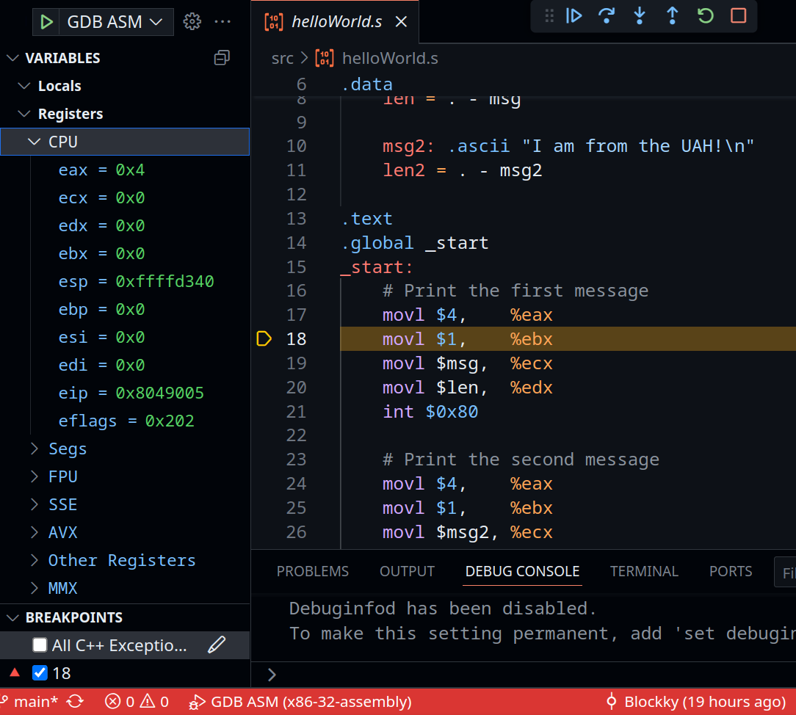

# x86-32 Assembly

Source code written in **x86-32 assembly** using **GAS (GNU Assembler) with AT&T syntax**.

These examples were developed during lab sessions of the course _Estructura y Organización de Computadores_ (Computer Structure and Organization in Spanish).

Tested and executed on both **WSL (Windows Subsystem for Linux)** and **Arch Linux** environments.

The repository also includes a `.vscode` folder with configuration files to assemble, link, and execute the programs using the **Run** button in VS Code (via the [Code Runner](https://marketplace.visualstudio.com/items?itemName=formulahendry.code-runner) extension).  
It also provides a debugger setup based on **GDB**, fully integrated into the IDE using the [C/C++ Debugger (gdb)](https://marketplace.visualstudio.com/items?itemName=ms-vscode.cpptools) extension.

